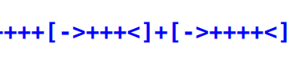

# Brainfuck Assembly Interpreter

A TypeScript-based interpreter for a Brainfuck-inspired assembly language. This project demonstrates how to parse, validate, and execute a simple assembly-like language that mimics the behavior of Brainfuck, with a focus on readability and extensibility.

## 🧠 Overview of Brainfuck

> “Brainfuck is an esoteric programming language created in 1993 by Swiss student Urban Müller. Designed to be extremely minimalistic, the language consists of only eight simple commands, a data pointer, and an instruction pointer.”  
> — [Wikipedia – Brainfuck](https://en.wikipedia.org/wiki/Brainfuck)

## Tech Stack

- 🟦 TypeScript
- 🟢 Node.js v24.0.0 (minimum recommended version)
- 📦 ES modules

## Dependencies

- 🚫 No program dependencies
- 🛠️ Only one development dependency: `@types/node`

## Features

- **Brainfuck Assembly Syntax**: Supports a readable set of instructions (`INC`, `DEC`, `RIGHT`, `LEFT`, `LOOP_START`, `LOOP_END`, `PRINT`).
- **Parser and Validator**: Tokenizes and validates input programs before execution.
- **Execution Context**: Simulates a Brainfuck memory tape with customizable size and value limits.
- **Output Printing**: Prints the result of the program execution in a user-friendly format.
- **TypeScript Implementation**: Written in modern TypeScript for type safety and maintainability.
- **Test Suite**: Includes tests for interpreter correctness.

## Todo

- [ ] Support reading from files.
- [ ] Example Brainfuck code files.
- [ ] Result types for better error handling.
- [ ] More unit tests.

## Implemented Instructions

| Brainfuck Assembly | Original Brainfuck | Command Meaning                   |
|--------------------|--------------------|------------------------------------|
| `INC`              | `+`                | Increment the value at the current memory cell by 1 |
| `DEC`              | `-`                | Decrement the value at the current memory cell by 1 |
| `LEFT`             | `<`                | Move the memory pointer one cell to the left        |
| `RIGHT`            | `>`                | Move the memory pointer one cell to the right       |
| `LOOP_START`       | `[`                | Begin a loop (continue while current cell ≠ 0)       |
| `LOOP_END`         | `]`                | End a loop (jump back if current cell ≠ 0)          |
| `PRINT`            | `.`                | Output the ASCII character at the current cell      |

## Supported Terminals

The project uses ANSI escape codes and works in modern terminals:

- 🍎 macOS (Terminal)
- 🐧 Ubuntu (GNOME Terminal)
- 🪟 Windows 10+ (Windows Terminal)

## Installation

1. **Clone the repository:**
   ```sh
   git clone https://github.com/krondorl/brainfuck-assembly-interpreter.git
   cd brainfuck-assembly-interpreter
   ```
2. **Install dependencies:**
   ```sh
   npm install
   ```

`npm` is the package manager of 🟢[Node.js](https://nodejs.org/en/download/current). So you need that installed before.

## Usage

Run the interpreter with the default program:

```sh
npm start
```

Or, to run a custom program, modify the `program` variable in `src/index.ts` and re-run the script.

### Example Output

```
Brainfuck Assembly interpreter

Result
A

Program executed.
```

## License

See the [LICENSE](./LICENSE) file for details.

## Links

- [Project GitHub Repository](https://github.com/krondorl/brainfuck-assembly-interpreter)
- [Brainfuck Wikipedia Article](https://en.wikipedia.org/wiki/Brainfuck)
- [Brainfuck Language Reference](https://esolangs.org/wiki/Brainfuck)
- [Brainfuck Example Applications](https://brainfuck.org/)

## History

- **2025-07-09**: Additional documentation and upload to GitHub.
- **2025-07-06**: Initial source code with core interpreter, parser, and test suite.
